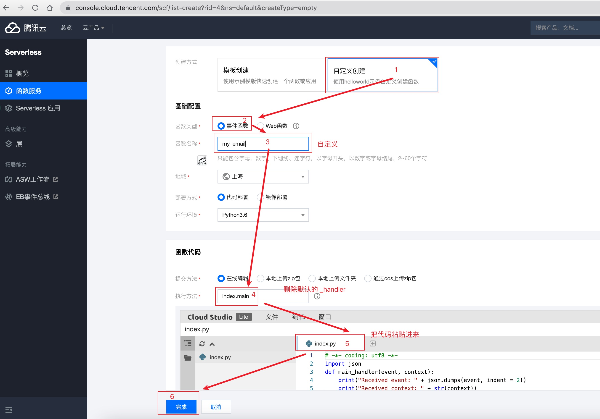
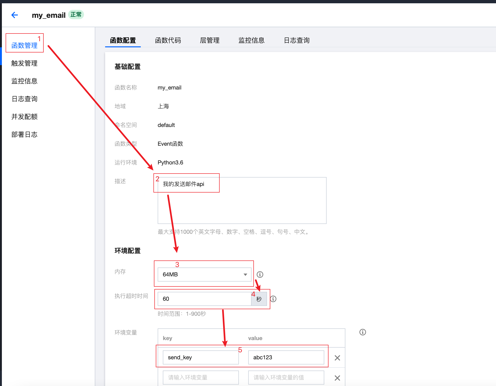
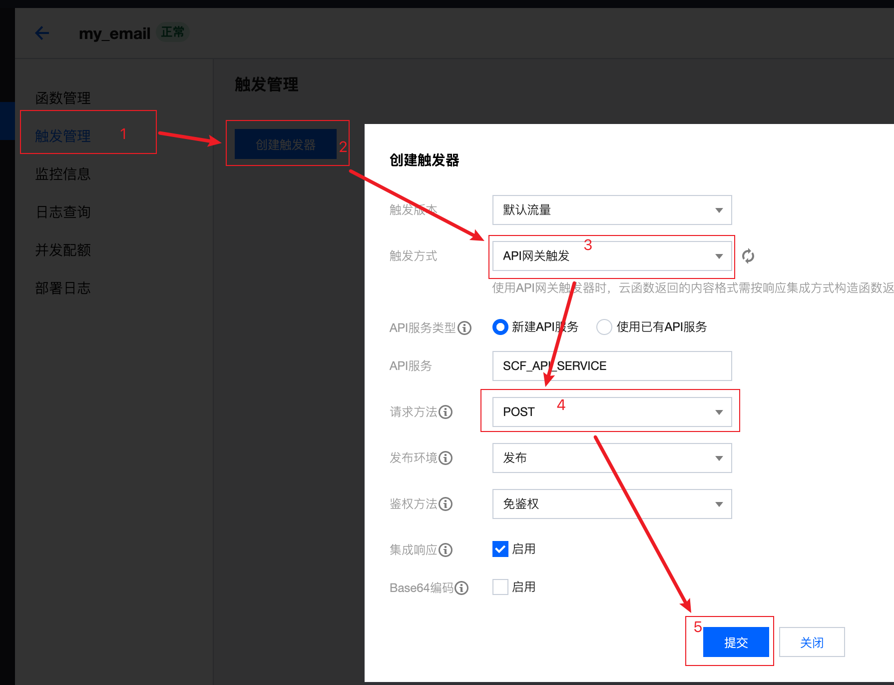

# scf-sendmail

## 介绍

使用腾讯云函数，创建属自己的【发送邮件api】

## 快速开始

1. 登录 https://console.cloud.tencent.com/scf/list
2. 新建函数


3. 设置环境变量

注意`abc123`是发送key，需要自定义，建议设置的复杂一些。

4. 设置api网关


5. 得到一个访问路径类似


6. 开始使用

对这个访问路径发送post请求
请求体格如下:

```json
{
    "send_key":"abc123",
    "subject":"我是邮件主题",
    "content":"我是邮件正文",
    "smtp_server":"smtp.yourdomail.com",
    "smtp_port":"465",
    "mail_acct":"user@yourdomail.com",
    "mail_paswd":"xxx",
    "mail_to":"receiver@xxx.com",
    "from_nikename":"发件人显示昵称",
    "to_nikename":"收件人显示昵称"
}
```

7. 使用示例

python:
```python
import requests
import json

url = "https://service-xxxx-xxxx.sh.apigw.tencentcs.com/release/my_email"

payload = json.dumps({
    "send_key":"abc123",
    "subject":"我是邮件主题",
    "content":"我是邮件正文",
    "smtp_server":"smtp.yourdomail.com",
    "smtp_port":"465",
    "mail_acct":"user@yourdomail.com",
    "mail_paswd":"xxx",
    "mail_to":"receiver@xxx.com",
    "from_nikename":"发件人显示昵称",
    "to_nikename":"收件人显示昵称"
})
headers = {
  'Content-Type': 'application/json'
}

response = requests.request("POST", url, headers=headers, data=payload)

print(response.text)
```

curl:

```bash
curl --location --request POST 'https://service-xxxx-xxxx.sh.apigw.tencentcs.com/release/my_email' \
--header 'Content-Type: application/json' \
--data-raw '{
    "send_key":"abc123",
    "subject":"我是邮件主题",
    "content":"我是邮件正文",
    "smtp_server":"smtp.yourdomail.com",
    "smtp_port":"465",
    "mail_acct":"user@yourdomail.com",
    "mail_paswd":"xxx",
    "mail_to":"receiver@xxx.com",
    "from_nikename":"发件人显示昵称",
    "to_nikename":"收件人显示昵称"
}'
```
